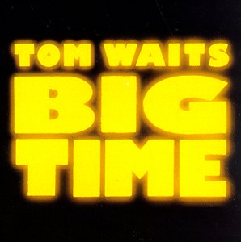
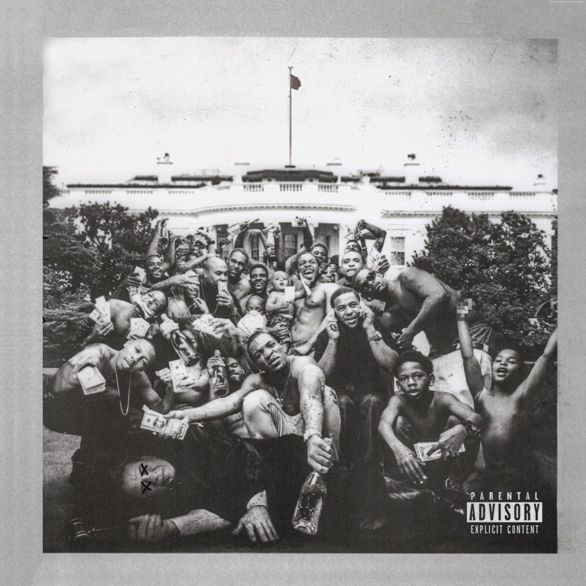
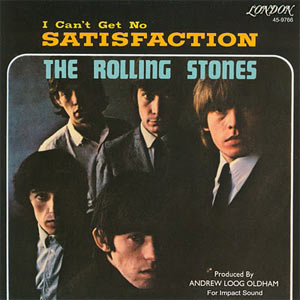
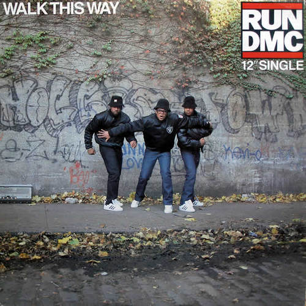

Did Lamar Just Kill Hip Hop?
============================

Ok, hold your horses. Just let me explain the theory and then judge. 

So according to my theory, every major popular music genre has roughly 30 years until it's done. Done in a sense that after that nothing can change our perception of what a genre is and what it should sound like.

Three Periods in a Life of a Genre
----------------------------------

As shown on the chart, every genre starts with a proto era (green area), in which it is slowly and gradually developing. Then comes the breakthrough single, that puts it on a map by drawing attention of listeners, artists and music business alike. This is the start of the genre's golden age which lasts roughly 10 years, and also a moment at which the clock starts ticking. Then follows 10 years of crisis in which two other genres steel the focus. In second half of the crisis era, there emerges one sub-genre, that brings out the worst of the genre, examples of which are glam rock, hair metal, skate punk, bling rap and brostep. Crisis ends with a revival of a genre that usually consists of many new and diverse sub-genres. 

And now comes a more controversial claim, that the death of a genre happens between two albums, made by an exceptional artist. One a masterpiece, that the artist is never again able to surpass, although he produces many more great albums, and the other the album after that. The masterpiece album rises expectations and appetites of many and the future of the genre seems bright, while actually it is standing on it's last legs.

Another thing that might be controversial in this theory, besides the selection of the "chosen ones", are the genres they are associated with. But anyways, lets list them, namely Tom Waits with Rock and roll, Beck with Rock, LCD Soundsystem with Punk and Kendrick Lamar with Hip-hop. Lamar is probably the least controversial choice among them, simply because he's a rapper, but still — if we look at the music on the Pimp a Butterfly, it's a mix of many diverse genres and sounds, everything from funk to jazz and that's something that is common to all chosen legendary albums. Specifically — Tom Waits' Big Time, a collection of live recordings of songs from his last three albums, could be described as anything from blues, gypsy music, ballads, blues rock and cabaret... Beck's Odelay could be described as a mixture of old-school hip hop, delta blues, country, grunge and noise. LCD Soundsystem's Sound of Silver contains mixture of electronica, funk, new wave, post-punk and Bowie's sound.

Selection of Genres
-------------------

Let's focus on the selection of genres and why they are divided as they are. First it should be mentioned, that the selected genres are defined with broadest possible definitions, meaning that, for instance: metal falls under rock, new wave and hardcore under punk, electro under hip hop, etc. After that, maybe the most glaring are the omissions of Pop and Jazz. Pop is, as it was mentioned many times before, the ultimate absorber and survivor, that will exist forever — Jazz is, on other hand, a genre that really comes to life only in a live setting and trough improvisation and something always gets lost when it's captured on a record. Also if you look closely at the EDM (electronic dance music) you'll notice that it does not start before 1990. That is because I excluded the EDM that is made for the dancefloor and only considered the part, that can be listened to sitting down.

Proto Rock and Roll Sub-genres
------------------------------

Another curiosity is a quantity of genres crammed into rock and roll before it's breakthrough single "Rock Around the Clock", that started the rock and roll craze in 1955. Reason for that is, that the progress from boogie-woogie to fully developed rock and roll was exceptionally gradual. This evolution basically consists of additions of new instruments and vocals to the rhythm, that stayed pretty much the same from the beginning. Of course there were the sub-genres that had their own rhythms, and are not meant to be included in proto R'n'R, such as western music (that usually falls under country music).

Big reason for the breakthrough that happened in '55 lies in fact that R&B and country markets started intersecting — before the war almost no white people were buying black music and vice versa. It is also worth mentioning that this fact, together with a short time that it took for single to be recorded and released, contributed to a more fluid progression of a style, that became known as a rock and roll.

Selection of Genre Defining Singles
-----------------------------------

So, as with rock and roll, every major genre that succeeded it, started with a huge hit single, that basically defined it — and so it happens that this singles were following each other in intervals of roughly 10 years. The other singles being "Satisfaction" by Rolling Stones for rock, "God Save the Queen" by Sex Pistols for punk, "Walk This Way" by Run-D.M.C. for hip hop and "Firestarter" by Prodigy for EDM. 

For rock other candidates could be earlier single "You Really Got Me" by Kinks, if one would want to include the whole British garage rock scene or maybe some later single that was not anymore in style of garage rock like "Light My Fire" by the Doors. "God Save the Queen" as a breakthrough single of a punk genre is hard to dispute, although Ramones' "Blitzkrieg Bop", from a year before was artistically much more important. As for hip hop, I think "Walk This Way" is a good fit, although it could be argued, that it sounds too old-school and that some other artists from next two years, like N.W.A. or Public Enemy better define hip hops step into golden age. Nonetheless, none of them had such a big hit as Run-D.M.C. had. For EDM—if we define it as an electronic dance music, that can be listened to sitting down—the commercial success of Prodigy's album "Fat Of The Land" must be the big breakthrough moment.

Proto Hip Hop Sub-genres
------------------------

Now I should probably address the oddity of exceptionally long era of proto hip hop. I must admit that it wasn't in my model from the beginning when I recognized "Rapers delight" by Shugarhill Gang as a start of hip hop's proto phase. In this early version funk, disco and reggae were placed in a revival phase of rhythm and blues. Problem with this approach is that R&B was pretty much always just an umbrella term for black music styles, that didn't exist before 1945. Also original R&B that has been played from 1945 to 1955, was together with rockabilly basically what became know as rock and roll after its breakthrough in 1955 and it has stylistically little in common with later "R&B". Another solution could also be to create a separate timeline for each one of these genres, but none of them had enough longevity and prominence to justify that also — so that's the reason that they got packaged inside the proto hip hop era.

Is it too Good to be True?
--------------------------

So how come this eras coincide so neatly? I must admit I didn't bother with it too much, but it must have something to do with the economics. One theory could be based on the fact that the biggest force in sales of the albums were, at least from the mid 40s onward, the teenagers, which are at around the age of 14/15 most susceptible to the new music trends — and this new trends, must by definition sound and feel fresh and hip. They must be something your parents dislike and just don't get. So by this logic, if a genre is at the point or resurgence, this 15 year old teenager was 5 when it came into crisis, so just young enough to not yet be susceptible to the popular music.

No New Genre in 2006 — How come?
--------------------------------

So only inconsistency on the timeline left is a lack of emergence of a new major genre around year 2006. There are two possible explanations. First one is that we can adequately classify popular music only in retrospective, and so are lacking the perspective, that will allow us to fully understand what is currently happening in music. But this explanation just feels insufficient if we take in consideration what a huge stirs rock and roll and rock created in their first years, how distinctive punk was from the rock of its era, and the hard separation of hip hop from other genres by a simple fact that the lyrics are being raped. In this case probably the more pessimistic explanation is true, namely that there are no new major genres because the music industry as we knew it was already in such a bad shape by the 2006, that it wasn't able to procreate and push out the next big thing.

Conclusion
----------

As for conclusion, I must say, that I find it hard to believe that hip hop has died in 2017. Maybe hip hop as we know it died, but a new kind of hip hop, musically much more daring and vibrant has just been born, and Lamar's single "Be Humble" might just be the big breakthrough of this new kind of hip hop, that was slowly fermenting during last 10 years.

